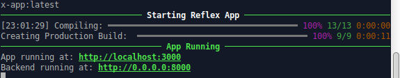
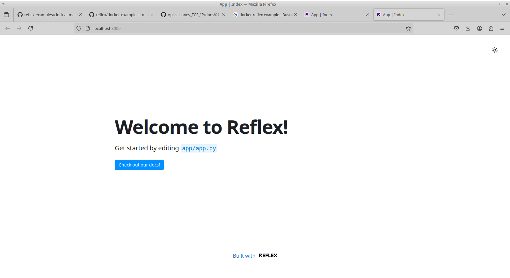

# Aplicacion de Prueba REFLEX

A continuacion se muestra un ejemplo de una aplicacion de prueba utilizando la API de REFLEX. Dicho ejemplo fue creado y compartido por el usuario @masenf detro de la plataforma de GitHub. El ejemplo se encuentra en un contenedor docker, y al ejecutarlo se levanta una pequeña aplicacion de manera local con un Front-End y un Back-End.

Los pasos para correr la aplicacion son los siguientes:

Instalar Python, Docker y la libreria de REFLEX en caso de no contar con estos programas y librerias.
La libreria de Streamlit se puede instalar ejecutando la siguiente linea en cualquier terminal
```
pip install reflex
```

Luego, crear el archivo `dockerfile` y guardar dentro de este el siguiente codigo:

```
FROM ubuntu:22.04

RUN apt update && apt upgrade -y && apt install -y python3-pip unzip curl

RUN mkdir -p /REFLEX/REFLEX
COPY ./clock/clock.py /REFLEX/
COPY requirements.txt /REFLEX/

WORKDIR /REFLEX
RUN pip install -r requirements.txt

RUN echo '#!/bin/bash' > init_reflex.sh \
    && echo 'echo "blank" | reflex init' >> init_reflex.sh \
    && echo 'cp /REFLEX/clock.py /REFLEX/REFLEX/REFLEX.py' >> init_reflex.sh \
    && chmod +x init_reflex.sh

CMD ["bash", "-c", "./init_reflex.sh && reflex run"]
```

Luego, crear la imagen de Docker para la API utilizando la siguiente linea:

```
docker build -t reflex-app:latest .
```

Por ultimo, ejecutar el contenedor de docker utilizando el comando `docker run`:

```
docker run -it --rm -p 3000:3000 -p 8000:8000 --name app reflex-app:latest
```

Tras haber ejecutado correctamente el contenedor, veremos el siguiente mensaje dentro de la terminal, indicando que podemos acceder a la web de nuestra API utilizando la siguiente direccion:

```
http://0.0.0.0:3000
```



### Ejemplo de Aplicacion de bienvenida de REFLEX:

