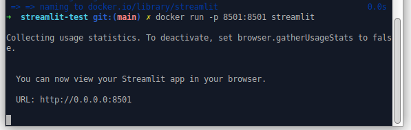
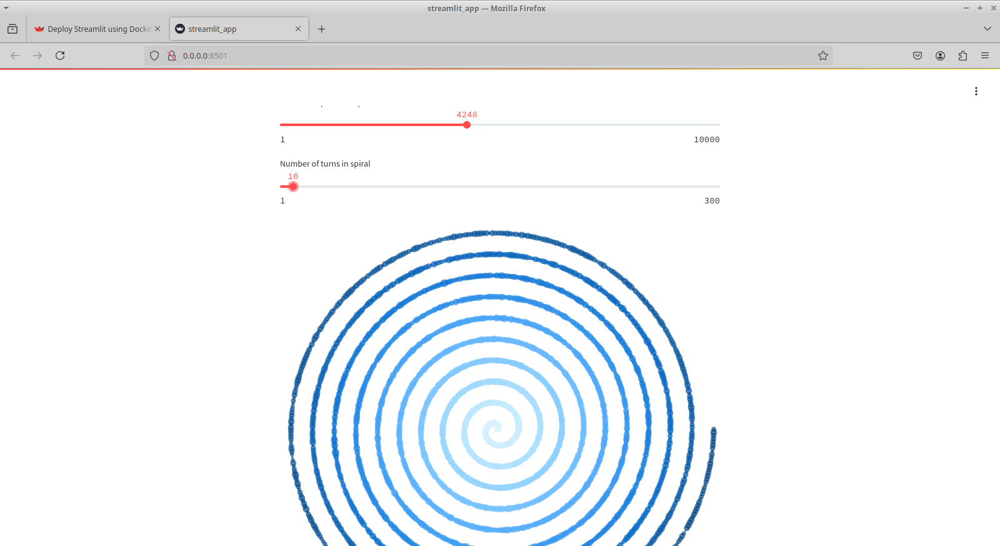

# Aplicacion de Prueba Streamlit 

A continuacion se muestra un ejemplo de una aplicacion de prueba utilizando la API de Streamlit. Dicho ejemplo se encuentra dentro de la documentacion oficial de la aplicacion. El ejemplo se encuentra en un contenedor docker, y al ejecutarlo, se hace una copia de un repositorio de Git alojado en la web de una aplicacion pre-fabricada de streamlit, y se la ejecuta localmente.

Los pasos para correr la aplicacion son los siguientes:

Instalar Python, Docker y la libreria de Streamlit en caso de no contar con estos programas y librerias.
La libreria de Streamlit se puede instalar ejecutando la siguiente linea en cualquier terminal
```
pip install streamlit
```

Luego, crear el archivo `dockerfile` y guardar dentro de este el siguiente codigo:

```
# app/Dockerfile

FROM python:3.9-slim

WORKDIR /app

RUN apt-get update && apt-get install -y \
    build-essential \
    curl \
    software-properties-common \
    git \
    && rm -rf /var/lib/apt/lists/*

RUN git clone https://github.com/streamlit/streamlit-example.git .

RUN pip3 install -r requirements.txt

EXPOSE 8501

HEALTHCHECK CMD curl --fail http://localhost:8501/_stcore/health

ENTRYPOINT ["streamlit", "run", "streamlit_app.py", "--server.port=8501", "--server.address=0.0.0.0"]
```

Luego, crear la imagen de Docker para la API utilizando la siguiente linea:

```
docker build -t streamlit .
```

Por ultimo, ejecutar el contenedor de docker utilizando el comando `docker run`:

```
docker run -p 8501:8501 streamlit
```

Tras haber ejecutado correctamente el contenedor, veremos el siguiente mensaje dentro de la terminal, indicando que podemos acceder a la web de nuestra API utilizando la siguiente direccion:

```
http://0.0.0.0:8501
```



### Ejemplo de Aplicacion de Espiral:

